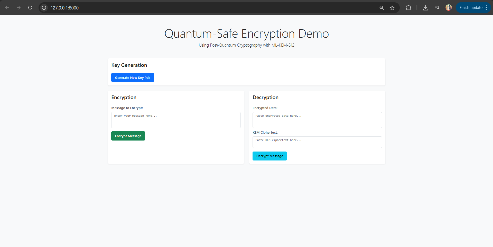

# Post-Quantum Cryptography Web Application

A secure web application demonstrating Post-Quantum Cryptography (PQC) techniques for encrypting and decrypting data using FastAPI and ML-KEM-512.

## Overview

This project implements a web-based demonstration of Post-Quantum Cryptography, specifically using the ML-KEM-512 algorithm. The application provides a user-friendly interface for key generation, message encryption, and decryption, showcasing the capabilities of quantum-resistant cryptography.



## Features

- 🔐 Quantum-safe encryption using ML-KEM-512
- 🎯 User-friendly web interface
- 🔑 Key pair generation
- 📝 Message encryption and decryption
- 🚀 Docker containerization
- ☁️ Cloud deployment on Render

## Tech Stack

- **Backend**: FastAPI, Python 3.11
- **Cryptography**: pqcrypto
- **Frontend**: HTML, CSS, JavaScript
- **Containerization**: Docker
- **Deployment**: Render
- **Dependency Management**: uv

## Project Structure

```
.
├── app/
│   ├── main.py          # FastAPI application
│   ├── routes/          # API routes
│   ├── static/          # Static files (CSS, JS)
│   └── templates/       # HTML templates
├── Dockerfile           # Docker configuration
├── render.yaml          # Render deployment config
├── requirements.txt     # Python dependencies
└── README.md           # Project documentation
```

## Getting Started

### Local Development

1. Clone the repository:
```bash
git clone https://github.com/Yusixs/post-quantum-cryptography.git
cd post-quantum-cryptography
```

2. Create and activate virtual environment:
```bash
uv venv
. .venv/bin/activate  # On Windows: .venv\Scripts\activate
```

3. Install dependencies:
```bash
uv pip install -r requirements.txt
```

4. Run the application:
```bash
uvicorn app.main:app --reload
```

5. Access the application at `http://localhost:8000`

### Docker Deployment

1. Build the Docker image:
```bash
docker build -t pqc-app .
```

2. Run the container:
```bash
docker run -p 8000:8000 pqc-app
```

## API Endpoints

- `GET /`: Main application interface
- `POST /generate-keys`: Generate new key pair
- `POST /encrypt`: Encrypt a message
- `POST /decrypt`: Decrypt a message

## Deployment

The application is deployed on Render at [https://post-quantum-cryptography.onrender.com/](https://post-quantum-cryptography.onrender.com/)

## Security Features

- Quantum-resistant encryption using ML-KEM-512
- Secure key generation and management
- Input validation and sanitization
- Secure HTTP headers
- Containerized deployment for isolation

## Contributing

Contributions are welcome! Please feel free to submit a Pull Request.

## License

This project is licensed under the Apache-2.0 License - see the LICENSE file for details.

## Acknowledgments

- [pqcrypto](https://github.com/backbone-hq/pqcrypto) for the PQC implementation
- [FastAPI](https://fastapi.tiangolo.com/) for the web framework
- [Render](https://render.com/) for hosting 